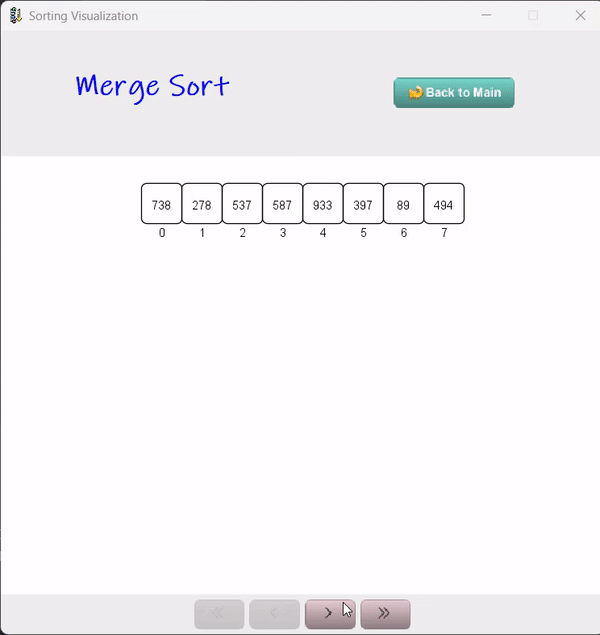
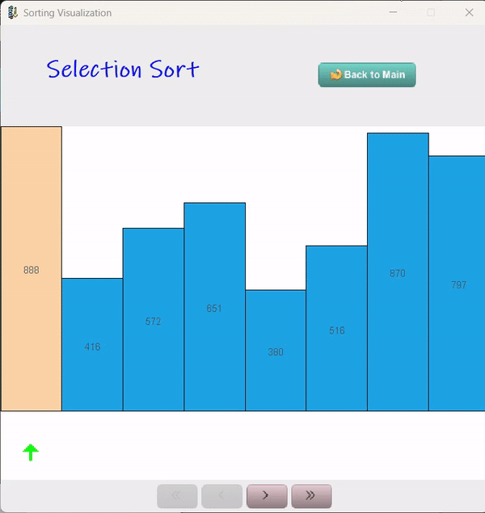

# Sorting Visualizer
This project is a sorting visualizer that visualizes the sorting algorithms in step by step manner. User can control each step of the sorting algorithm and can visualize the sorting process in a better way. This project is made using Java Swing and AWT libraries.

:star: If you find ToolJet useful, please consider giving us a star on GitHub! Your support helps us continue to innovate and deliver exciting features.


[](https://github.com/lochuung/Sorting-Visualizer/issues)
[](https://github.com/lochuung/Sorting-Visualizer/stargazers)


[](https://github.com/lochuung/Sorting-Visualizer)
[](https://facebook.com/lochuung)

## Features
- Visualize the sorting algorithms in step by step manner.
- User can control each step of the sorting algorithm.
- User can choose the sorting algorithm to visualize: `Bubble Sort`, `Selection Sort`, `Insertion Sort`, `Merge Sort`.

## Screenshots
<p align="center">
    
</p>
<br />
<p align="center">
    
</p>

## Installation
1. Clone the repository
```git clone https://github.com/lochuung/Sorting-Visualizer.git```
2. Open the project in any Java IDE (Eclipse, IntelliJ IDEA, NetBeans, etc.)
3. Run the project